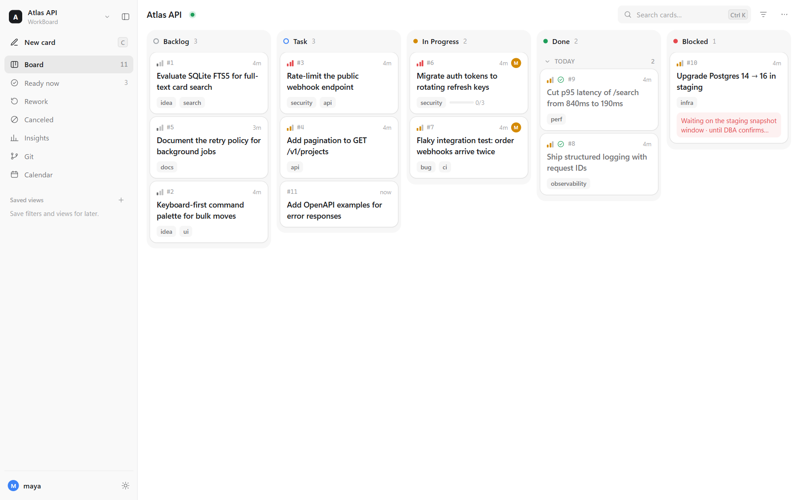

# WorkBoard

A local kanban board that you and your coding agents share: one board per project, one CLI, one local server.



## Why

- **People and agents on the same board.** Agents use the `workboard` CLI, which prints one concise line per action or JSON with `--json`. You use the browser. Both follow the same lifecycle rules: ownership, dependencies, an optional WIP limit and required write-ups.
- **One board per project.** The board lives in the repository at `board/board.json`, next to the code it describes. Agents find it from the working directory.
- **Crash-safe concurrent writes.** Every write takes a cross-process lock, is fsynced, atomically replaces the file and keeps rolling backups. A stale writer gets a visible 409 conflict. Nothing is silently overwritten or retried automatically.
- **Local and dependency-free.** Written in pure Python with only the standard library; the release binaries don't need Python. The server listens on `127.0.0.1` only.

## Install

With [npm](https://www.npmjs.com/package/workboard) (Node.js 18 or newer) on Windows, macOS and Linux:

```sh
npm install -g workboard
```

Without Node.js, use the install script. On macOS and Linux:

```sh
curl -fsSL https://github.com/Paliverse/workboard/releases/latest/download/install.sh | sh
```

On Windows (PowerShell):

```powershell
irm https://github.com/Paliverse/workboard/releases/latest/download/install.ps1 | iex
```

Both install the `workboard` command and the short alias `wb`. Self-contained binaries for Windows, macOS and Linux (x64 and arm64) are also attached to every [GitHub Release](https://github.com/Paliverse/workboard/releases) for manual installs. See [docs/install.md](docs/install.md) for details and troubleshooting.

## Quickstart

```sh
workboard setup    # install the agent skill and the background server
cd my-project
workboard init     # create board/board.json and register the board
workboard open     # open http://127.0.0.1:7891/b/my-project/ in your browser
```

Then work from the board or the CLI:

```sh
workboard add --title "Ship the login page" --priority mid
workboard digest   # a short summary of the board
```

## Agent setup

`workboard setup` (or `workboard skills install`) installs the bundled agent skill for every supported harness:

| Harness | Skill file |
|---|---|
| Codex, Pi, Oh My Pi, Gemini CLI, Cursor, OpenCode, GitHub Copilot | `~/.agents/skills/workboard/SKILL.md` |
| Claude Code | `~/.claude/skills/workboard/SKILL.md` |

On Windows, `~` is `%USERPROFILE%`. Restart running agent sessions so they load the skill. Give each agent its own label with `--actor NAME` or `WORKBOARD_ACTOR`. Agents only need the CLI; they never need the server. See [docs/agents.md](docs/agents.md).

## Board UI

- Views: Board, Ready now, Rework, Canceled, Insights, Git (local and read-only) and Calendar, each with live counts.
- Drag cards between and within columns. Drag a column sideways to reorder it, or onto another column to stack it vertically. Moves and layout changes can be undone with Ctrl+Z.
- Cards open in a side panel for title, priority, tags, dependencies, links, subtasks, notes, write-up, files, activity and comments. Lifecycle actions (Start, Complete, Block, Resume, Take over, Cancel, Rework, Reopen, Improve, Follow-up) go through the same server-side checks as the CLI.
- Card notes are a collapsible timeline, newest first and grouped by day. Each entry shows a one-line summary and expands to its markdown body. Pinned notes above it hold durable context such as acceptance criteria, and Add note appends an entry from the browser.
- Live updates arrive over Server-Sent Events. Only changed cards are patched, and a field you are editing is never overwritten.
- Search with Ctrl/Cmd+K or `/`, filter by status, priority, owner, outcome, rework or tag, and choose a System, Light or Dark theme. `C` creates a card, `[` toggles the sidebar and Esc closes the top layer.
- A board switcher moves between registered boards in the same tab.

## How it works

- **One server for all boards.** A single per-user server at `http://127.0.0.1:7891/` serves every registered board at `/b/<board>/`. The root page lists your boards. `workboard setup` installs it as a background service; `workboard serve` runs it in the foreground.
- **A registry.** `~/.workboard/boards.json` maps board names to board files. `workboard init` and `workboard open` register boards, and `workboard boards` lists them.
- **Plain files in the project.** Each project keeps `board/board.json` (the source of truth), `board/.backups/` (the 10 newest snapshots), `board/archive/` (swept Done cards) and `board/attachments/` (uploaded files). Commit them or ignore them as you prefer.
- **The CLI doesn't need the server.** Board commands lock and write the file directly. They never start a server or open a browser.
- **Revision guards.** CLI card mutations pass `--expected-rev` and conflict only when *that card* changed. The browser conflicts when the board changed. Either way you get a 409 and nothing is overwritten.

Details: [docs/architecture.md](docs/architecture.md).

## Configuration

| Variable | Default | Purpose |
|---|---|---|
| `WORKBOARD_HOME` | `~/.workboard` | Registry, server state, logs and the Windows service runtime |
| `WORKBOARD_PORT` | `7891` | Server port on `127.0.0.1` |
| `WORKBOARD_ACTOR` | `user` | Actor label recorded on writes (`--actor` overrides it) |
| `WORKBOARD_DEFAULT_BOARD` | unset | Board to use when `--board` is not given, instead of searching from the current directory |
| `WORKBOARD_SCOPE_ROOT` | unset | Write fence: refuse any write outside this directory |

## Upgrade

```sh
workboard version --check   # compare with the latest release
workboard upgrade           # upgrade through the channel you installed with
```

`workboard upgrade` stops the running server, upgrades the way you installed (`npm install -g workboard@latest`, or the install script again), refreshes installed skills and restarts the service. `workboard upgrade --dry-run` prints the plan without running it.

## Uninstall

```sh
workboard service remove   # stop the server and remove the background service
workboard skills remove    # remove the agent skill files
```

Then remove the program: `npm uninstall -g workboard`, or delete the install script's directory. On Windows that is `%LOCALAPPDATA%\Programs\WorkBoard`; also remove it from your user `PATH` if the script added it. On macOS and Linux, delete `${XDG_DATA_HOME:-~/.local/share}/workboard` and the `~/.local/bin/workboard` and `~/.local/bin/wb` links. Your boards stay in their projects. Delete `~/.workboard` to remove the registry and logs. See [docs/install.md](docs/install.md#uninstall).

## Documentation

- [Installation](docs/install.md): channels, setup, the background service, uninstalling and troubleshooting
- [Agents](docs/agents.md): harness skill paths, actors and concurrency etiquette
- [CLI reference](docs/cli.md): every command and flag
- [HTTP API](docs/http-api.md): server and per-board endpoints
- [Architecture](docs/architecture.md): modules, data layout, locking and the server
- [Releasing](docs/releasing.md): the maintainer release process

## Contributing

Bug reports, ideas and pull requests are welcome. Read [CONTRIBUTING.md](CONTRIBUTING.md) and the [Code of Conduct](CODE_OF_CONDUCT.md). Report security issues privately as described in [SECURITY.md](SECURITY.md).

## License

[Apache License 2.0](LICENSE)
