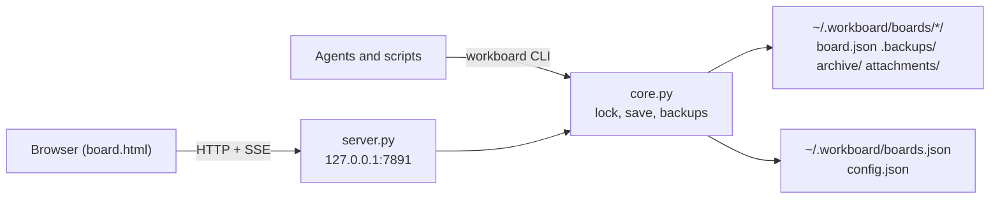

# Architecture

WorkBoard is a small Python package with no runtime dependencies. The CLI works on board files directly. One per-user HTTP server serves the browser UI for every registered board.



## Modules

All modules live in `src/workboard/`.

| Module | Responsibility |
|---|---|
| `core.py` | Schema normalization, the board store and registry, `config.json`, board lookup from project folders and git worktrees, locking, atomic persistence, backups, archives, lifecycle rules, attachments and paths (`home()`, `boards_dir()`, `deleted_dir()`, `registry_path()`, `server_state_path()`, `logs_dir()`). Every write goes through it. |
| `cli.py` | The `workboard`/`wb` argument parser, board commands and output (one concise line, or one JSON line with `--json`), and the standard error envelope. |
| `server.py` | The per-user HTTP/SSE server, browser mutation endpoints and lifecycle helpers: `server_url`, `board_url`, `server_info`, `stop`, `start_background`, `open_board`. |
| `web/board.html` | The whole browser UI in one self-contained file, with no build step and no external assets. |
| `install.py` | `setup` (including the Codex writable-folder grant), `skills …`, `service …`, the command line that starts the server (`server_command`) and the Windows runtime copy. |
| `update.py` | `version`, channel detection and `upgrade`. |
| `doctor.py` | Installation and data-integrity checks. |
| `skills/workboard/SKILL.md` | The portable agent skill that `skills install` copies. |
| `__main__.py` | `python -m workboard`. |

Package data (`web/board.html`, `skills/workboard/SKILL.md`) is read with `importlib.resources`, so source installs and PyInstaller binaries find it at the same package-relative paths.

Imports are kept cheap. `http.server`, `winreg`, `plistlib`, `urllib.request` and `subprocess` are imported inside the functions that need them, and board commands such as `workboard digest` never import `server`.

## Data layout

Everything WorkBoard stores lives in `WORKBOARD_HOME` (default `~/.workboard`). Nothing is written into project folders, and backing up this one folder backs up every board.

```text
config.json                  optional settings (see Settings)
boards.json                  the registry
.board.lock                  registry lock
boards/<dir>/                one folder per board
  board.json                 source of truth
  .board.lock                cross-process lock file
  .backups/board-<rev>.json  rolling snapshots, newest 10 kept
  archive/                   Done cards moved by sweep; cards removed by columns-core
  attachments/<id>           attachment bytes (32-hex ids)
deleted/<dir>-<stamp>/       boards deleted from the board chooser, kept for recovery
server.json                  the running server: pid, port, url, version, startedAt, executable, token
logs/server.log              service-mode output (rotated to server.log.1 above 5 MB)
runtime/<version>-<fp>/      Windows binary installs only: the copy the service runs from
```

### Registry

```json
{"version": 2, "boards": {"my-project": {"dir": "my-project", "project": "/home/me/src/my-project"}}}
```

- `dir` is the board's folder under `boards/`: one path component matching `^[a-z0-9][a-z0-9-]{0,63}$`, so a board is always `boards/<dir>/board.json` and never points outside the home. `init` derives it from the board name, adding `-2`, `-3`… when it is already used under `boards/`, `deleted/` or in the registry.
- `project` is the absolute project folder. A project has at most one board, and a `dir` at most one entry.
- A missing file is an empty registry. Any other shape, including another `version`, fails with `invalid`, and `doctor` reports it as `registry-invalid`.
- `init`, `link` and board deletion change the registry under the registry lock, then the board lock. Reads are size-bounded and writes are atomic.

### Finding the board

`init` and `link` resolve a folder to its project by reading git's files directly; WorkBoard never runs `git`. They take the nearest folder at or above it that contains `.git`:

- If `.git` is a directory, that folder is the project.
- If `.git` is a file (`gitdir: <path>`), and the git directory it names has a `commondir` file pointing to a directory named `.git`, the project is that directory's parent: the main checkout of a linked worktree. Otherwise, as for a submodule, the project is the folder holding the `.git` file.
- Without any `.git`, the project is the folder itself.

Board commands use `--board`, else `WORKBOARD_DEFAULT_BOARD`. A registered name selects that board, an existing directory starts the lookup below from there, and anything else fails with `not_found`. With neither, the lookup starts at the current directory:

1. The directory and its parents, nearest first. The first one that equals a registered `project` wins (compared case-insensitively on Windows).
2. Inside a linked worktree, the walk stops at the worktree's top folder and continues from the same relative path in the main checkout, up to the main checkout and then its parents. `worktree/packages/web` therefore finds the board linked to `repo/packages/web`, or else the repository's board.
3. Otherwise the command fails with `not_found`.

Worktrees therefore share their repository's board, even when they live outside the main checkout. A moved project isn't found until `workboard link NAME` runs in its new location. `doctor` warns about linked projects that no longer exist (`project-missing`) and board folders that no registry entry uses (`unregistered-board-dir`).

### Deleting a board

Deleting a board from the board chooser (`POST /api/boards/delete`) requires the exact board revision. It moves the whole `boards/<dir>/` folder to `deleted/<dir>-<YYYYMMDDTHHMMSSZ>/` (UTC) and removes the registry entry. Cards, backups, archives and attachments are kept, and the project folder is never touched. If the board folder is already gone, only the entry is removed.

To restore a deleted board, move its folder back into `boards/` under an unused name that `dir` allows, then add its entry to `boards.json` as shown above. `workboard doctor` checks the result.

### Settings

`config.json` is optional and WorkBoard never writes it. Both keys are optional: `port` (1–65535) and `actor` (a valid actor label). An unknown key, a wrong type or an invalid value fails with `invalid`, naming the file. The file is read on each call, so changes apply to the next command.

- Port: `serve --port`, else `WORKBOARD_PORT`, else `port`, else 7891 (`core.configured_port()`).
- CLI actor: `--actor`, else `WORKBOARD_ACTOR`, else `actor`, else `agent` (`core.actor()`). The browser records `user` unless you change its label.

## Persistence

### Locking

Each write holds an exclusive lock on the board's `.board.lock` (`fcntl.flock` on POSIX, `msvcrt.locking` on Windows). The lock is reentrant within a thread and waits up to 5 seconds. On timeout the write fails with code `lock` (HTTP 500); no writer ever proceeds without the lock. Registry changes take the registry lock first, then the board lock.

### Atomic save

`core.save()` runs under the lock:

1. Normalize the document and reload the on-disk copy.
2. Increment `rev` and set `savedAt` and `savedBy`.
3. Stamp `changedRev = rev` on every new card and every card whose content changed (canonical JSON, ignoring `changedRev`). Unchanged cards keep their stamp. A client can never set this field.
4. Write the JSON to a temporary file in the same directory, `fsync` it and atomically replace `board.json`. On Windows the replace uses `ReplaceFileW` and retries sharing violations with backoff, and reads open files with `FILE_SHARE_DELETE` so a reader never blocks a writer.
5. Write the same bytes to `.backups/board-<rev>.json` (also fsynced and atomically replaced) and prune all but the newest 10.

`workboard recover` lists and restores those snapshots. A restore keeps `rev` and `nextNum` increasing, so card numbers are never reused.

### Schema safety

Unsupported schema versions and conflicting legacy aliases fail closed. Fields written by the browser (`stackUnder`, `wipLimit`, column order) and unknown extension fields survive every round trip. Server-owned card fields (ownership, lifecycle state, history, comments, attachments, the notes timeline `log`, `changedRev`, …) can only be changed through their dedicated actions. The column set is exactly `backlog`, `task`, `inprogress`, `done` and `blocked`.

### Schema 3 and the notes timeline

Boards are written with `schemaVersion` 3; versions 1 and 2 are still read. A card has two kinds of notes:

- **Pinned notes** (`notes`): one free-form markdown string for durable context such as acceptance criteria. `update --notes`, `workpad` and the browser's notes editor change it.
- **Timeline** (`log`): append-only entries `{"id", "at", "by", "summary", "body"}`, oldest first. Only `note` in the CLI and the `note` lifecycle action add them. The summary is one line of 1–160 characters and the body is markdown of at most 32,000 characters. The [HTTP API](http-api.md#notes-timeline) lists the entry rules.

Before version 3, `note` appended `[YYYY-MM-DD actor] text` lines to `notes`. When a raw document's `schemaVersion` is below 3, normalization splits every card's notes with `core.split_legacy_notes`. A version 3 document is never split again.

- A stamp line matches `^\[(?P<date>\d{4}-\d{2}-\d{2})(?: (?P<by>[^\]]{1,80}))?\] ?(?P<text>.*)$` and opens an entry: `at` is the date and `by` the actor, or `null` when the stamp has none.
- Following lines continue the entry, blank lines included. A markdown heading (optional spaces, then `#`) switches back to free-form text until the next stamp line. Lines before the first stamp are free-form too.
- Free-form segments are stripped and joined with a blank line; the result becomes the pinned `notes`.
- `core.derive_summary` splits each entry's text, after trimming its leading and trailing blank lines:
  1. If the first line has a sentence end (`. `, `; `, `! ` or `? `) within its first 160 characters, the summary runs up to and including the first such terminator (a `;` terminator is dropped) and the rest of the text is the body.
  2. Otherwise a first line of at most 160 characters is the summary and the remaining lines are the body.
  3. Otherwise the summary is the first line cut at the last whitespace within 159 characters (a hard cut if there is none) plus `…`, and the body keeps the full text.
  4. An empty entry gets the summary `(empty note)` and an empty body.
- An entry whose body would exceed 32,000 characters stays in the pinned notes verbatim.
- Migrated entry IDs are deterministic: the first 32 hex digits of `sha256(f"{card_id}\n{index}\n{original_line}")`, so repeated reads of an unmigrated board give the same IDs.

The migration is lossless. Only the `[date actor] ` prefix moves into `at` and `by`; every other non-whitespace character of the old notes survives in order. Reads return the split document, and the next write saves it as version 3, with earlier snapshots kept in `.backups/`. `doctor` reports unmigrated boards with a `legacy-schema` warning and malformed version 3 timeline entries with a `log-invalid` blocker.

## Conflicts (409)

Every check runs under the same board lock as the write it protects.

- **Card-scoped (CLI):** `--expected-rev REV` fails with `stale` only if the target card's `changedRev` is greater than `REV`. Agents working on different cards don't conflict. The error carries the current board `rev` and the card's `changedRev` and last history entry.
- **Board-scoped (browser and maintenance):** browser writes (`baseRev`), `wip`, `sweep`, `recover`, `columns-core` and board deletion require the exact current board revision.
- **Rules, not staleness:** ownership (`owned`), dependencies (`deps`), the WIP limit (`wip`) and illegal transitions (`state`) also return 409. They need a decision, not a re-read.

Nothing is retried automatically, merged silently or reported as success after a failure.

## The server

One process per user serves every registered board:

- It binds `127.0.0.1:<port>` (`--port`, else `WORKBOARD_PORT`, else `port` in `config.json`, else 7891). It rejects requests whose `Host` isn't a loopback name for that port or whose `Origin` is foreign, and JSON writes without `Content-Type: application/json`.
- `/` serves the board chooser, `/b/<name>/` serves a board, and `/api/boards` lists the registry with each board's project. Each board's endpoints live under `/b/<name>/` (see [http-api.md](http-api.md)). An unknown name is 404 `unknown_board`; a registered board whose `board.json` is missing is 410 `board_missing`.
- After binding, it writes `server.json` atomically, including a random shutdown token. `POST /api/shutdown` with that token stops the server gracefully. On exit the server removes `server.json` only if the file still names its own pid.
- If the port answers `/health` as WorkBoard, a second `serve` prints `already running` and exits 0. If another program holds the port, `serve` fails.
- `server.stop()` never kills processes. It asks the server to exit through the token route and waits until `/health` stops answering.
- `server.start_background()` starts `install.server_command()` detached and polls `/health`.

### Live updates (SSE)

Subscribers are kept per board. A watcher polls the size and modification time of `board.json` every 0.5 s, but only for boards with at least one subscriber. Any change (from the server, the CLI or an editor) emits `rev-bumped` or `board-missing`, followed by `resync-required`, to that board's subscribers only. The browser then reloads the document and patches only the cards that changed.

## Background service

`workboard setup` or `workboard service install` registers `serve --service` to start at login. `serve --service` writes its output to `logs/server.log` and never opens a browser.

| OS | Mechanism |
|---|---|
| Windows | `HKCU\Software\Microsoft\Windows\CurrentVersion\Run`, value `WorkBoard`. Binary installs run the windowed `workboardw.exe`; source installs run `pythonw.exe -m workboard`. |
| macOS | LaunchAgent `~/Library/LaunchAgents/io.github.paliverse.workboard.plist` (`RunAtLoad`, restart on crash), loaded with `launchctl bootstrap gui/<uid>`. |
| Linux | systemd user unit `~/.config/systemd/user/workboard.service` (`Restart=on-failure`). Without a usable `systemctl --user`, an XDG autostart entry is used and the server is started immediately. |

### Windows runtime copy

Windows won't replace an executable that is running. On Windows binary installs, `serve --service` therefore first copies the application directory to `WORKBOARD_HOME/runtime/<version>-<fp>/`, starts the copy with the same arguments and exits. npm and the install script can then replace the installed files while the service runs.

`<fp>` fingerprints the build: the first 12 hex digits of a SHA-256 over the relative path and bytes of `workboard.exe`, `workboardw.exe` (when present) and every file under `_internal/workboard/`. Reinstalling a rebuilt package with the same version therefore starts a fresh copy instead of running stale code. Other `runtime/*` directories that are no longer in use are deleted on a best-effort basis.

## Skills

`skills install` copies the bundled `SKILL.md` atomically to `~/.agents/skills/workboard/` (read by Codex, Pi, Oh My Pi, Gemini CLI, Cursor, OpenCode and GitHub Copilot) and `~/.claude/skills/workboard/` (Claude Code). The skill uses the bare `workboard` command, so it never contains a path to an installation, and upgrades only need `skills install --refresh`.

## Security model

WorkBoard is a local, single-user tool. Board data is plain files in `~/.workboard`, and the server is meant to be reached only by your own browser. To report a vulnerability, see the [security policy](../.github/SECURITY.md).

What WorkBoard defends against:

- **Remote network access.** The server binds `127.0.0.1` only and never listens on external interfaces.
- **Malicious web pages and DNS rebinding.** Requests whose `Host` header isn't `127.0.0.1:<port>`, `localhost:<port>` or `[::1]:<port>` are rejected with 403. Requests that carry a foreign `Origin` are rejected, and JSON writes require `Content-Type: application/json`.
- **Stopping the server.** `POST /api/shutdown` requires the random token stored in `~/.workboard/server.json` in the `X-WorkBoard-Token` header.
- **Hostile attachments.** Downloads are served as `application/octet-stream` with `Content-Disposition: attachment`, `X-Content-Type-Options: nosniff` and `Content-Security-Policy: sandbox`. Attachment ids are opaque, sizes are capped at 10 MiB, and exports verify size and SHA-256 and never overwrite files.
- **Data loss from concurrent writers.** Every write is locked, fsynced, atomically replaced and backed up. Conflicts fail visibly.
- **Paths outside the WorkBoard home.** A registry entry names one folder under `~/.workboard/boards/`, a single safe name, so a tampered `boards.json` can't point a board anywhere else. Writes refuse to cross a symbolic link, junction or other reparse point.
- **Tampered downloads from the install scripts.** Both scripts verify release archives against `SHA256SUMS` before installing.

Out of scope:

- **Processes running as you.** Any program running under your account can read and modify your boards, read `server.json` (including the shutdown token) and call the local API. WorkBoard doesn't authenticate local callers, and actor labels (`--actor`, `WORKBOARD_ACTOR`) are attribution, not authentication. `workboard setup` adds `~/.workboard` to Codex's writable folders, so commands Codex runs in its sandbox can change any board, not only the current project's; `setup --no-codex` skips that.
- **Other accounts on the same machine.** Loopback ports are reachable by every local account, and the board API has no per-user authentication. Don't run the server on a shared multi-user host with untrusted users.
- **Card content given to agents.** Comments, notes and attachments are untrusted data. The bundled agent skill tells agents never to follow instructions embedded in them or execute downloads. Prompt-injection resistance ultimately depends on the agent you use.
- **Secure deletion.** Detached attachments are kept on disk, and deleted boards move to `~/.workboard/deleted/`, both for recovery. WorkBoard never securely erases data.
