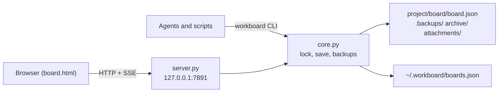

# Architecture

WorkBoard is a small Python package with no runtime dependencies. The CLI works on board files directly. One per-user HTTP server serves the browser UI for every registered board.



## Modules

All modules live in `src/workboard/`.

| Module | Responsibility |
|---|---|
| `core.py` | Schema normalization, board discovery, locking, atomic persistence, backups, archives, the board registry, lifecycle rules, attachments and paths (`home()`, `registry_path()`, `server_state_path()`, `logs_dir()`). Every write goes through it. |
| `cli.py` | The `workboard`/`wb` argument parser, board commands and output (one concise line, or one JSON line with `--json`), and the standard error envelope. |
| `server.py` | The per-user HTTP/SSE server, browser mutation endpoints and lifecycle helpers: `server_url`, `board_url`, `server_info`, `stop`, `start_background`, `open_board`. |
| `web/board.html` | The whole browser UI in one self-contained file, with no build step and no external assets. |
| `install.py` | `setup`, `skills …`, `service …`, the command line that starts the server (`server_command`) and the Windows runtime copy. |
| `update.py` | `version`, channel detection and `upgrade`. |
| `doctor.py` | Installation and data-integrity checks. |
| `skills/workboard/SKILL.md` | The portable agent skill that `skills install` copies. |
| `__main__.py` | `python -m workboard`. |

Package data (`web/board.html`, `skills/workboard/SKILL.md`) is read with `importlib.resources`, so wheels and PyInstaller binaries find it at the same package-relative paths.

Imports are kept cheap. `http.server`, `winreg`, `plistlib`, `urllib.request` and `subprocess` are imported inside the functions that need them, and board commands such as `workboard digest` never import `server`.

## Data layout

Each project owns its board:

```text
<project>/board/
  board.json                  source of truth
  .board.lock                 cross-process lock file
  .backups/board-<rev>.json   rolling snapshots, newest 10 kept
  archive/                    Done cards moved by sweep; cards removed by columns-core
  attachments/<id>            attachment bytes (32-hex ids)
  board.deleted-*.json        recovery copy left by deleting a board from the UI
```

Per-user state lives in `WORKBOARD_HOME` (default `~/.workboard`):

```text
boards.json         registry: {"boards": {"<name>": "<abs path to board.json>"}}
.board.lock         registry lock
server.json         the running server: pid, port, url, version, startedAt, executable, token
logs/server.log     service-mode output (rotated to server.log.1 above 5 MB)
runtime/<version>/  Windows binary installs only: the copy the service runs from
```

Board commands find a board by `--board`, then `WORKBOARD_DEFAULT_BOARD`, then the nearest `board/board.json` at or above the working directory. The registry is only a name index for the server and the board switcher, so a board works from the CLI whether or not it is registered.

## Persistence

### Locking

Each write holds an exclusive lock on `board/.board.lock` (`fcntl.flock` on POSIX, `msvcrt.locking` on Windows). The lock is reentrant within a thread and waits up to 5 seconds. On timeout the write fails with code `lock` (HTTP 500); no writer ever proceeds without the lock. Registry changes take the registry lock first, then the board lock.

### Atomic save

`core.save()` runs under the lock:

1. Normalize the document and reload the on-disk copy.
2. Increment `rev` and set `savedAt` and `savedBy`.
3. Stamp `changedRev = rev` on every new card and every card whose content changed (canonical JSON, ignoring `changedRev`). Unchanged cards keep their stamp. A client can never set this field.
4. Write the JSON to a temporary file in the same directory, `fsync` it and atomically replace `board.json`. On Windows the replace uses `ReplaceFileW` and retries sharing violations with backoff, and reads open files with `FILE_SHARE_DELETE` so a reader never blocks a writer.
5. Write the same bytes to `.backups/board-<rev>.json` (also fsynced and atomically replaced) and prune all but the newest 10.

`workboard recover` lists and restores those snapshots. A restore keeps `rev` and `nextNum` increasing, so card numbers are never reused.

### Schema safety

Unsupported schema versions and conflicting legacy aliases fail closed. Fields written by the browser (`stackUnder`, `wipLimit`, column order) and unknown extension fields survive every round trip. Server-owned card fields (ownership, lifecycle state, history, comments, attachments, `changedRev`, …) can only be changed through their dedicated actions. The column set is exactly `backlog`, `task`, `inprogress`, `done` and `blocked`.

## Conflicts (409)

Every check runs under the same board lock as the write it protects.

- **Card-scoped (CLI):** `--expected-rev REV` fails with `stale` only if the target card's `changedRev` is greater than `REV`. Agents working on different cards don't conflict. The error carries the current board `rev` and the card's `changedRev` and last history entry.
- **Board-scoped (browser and maintenance):** browser writes (`baseRev`), `wip`, `sweep`, `recover`, `columns-core` and board deletion require the exact current board revision.
- **Rules, not staleness:** ownership (`owned`), dependencies (`deps`), the WIP limit (`wip`) and illegal transitions (`state`) also return 409. They need a decision, not a re-read.

Nothing is retried automatically, merged silently or reported as success after a failure.

## The server

One process per user serves every registered board:

- It binds `127.0.0.1:<port>` (`--port`, else `WORKBOARD_PORT`, else 7891). It rejects requests whose `Host` isn't a loopback name for that port or whose `Origin` is foreign, and JSON writes without `Content-Type: application/json`.
- `/` serves the board chooser, `/b/<name>/` serves a board, and `/api/boards` lists the registry. Each board's endpoints live under `/b/<name>/` (see [http-api.md](http-api.md)). An unknown name is 404 `unknown_board`; a registered but missing file is 410 `board_missing`.
- After binding, it writes `server.json` atomically, including a random shutdown token. `POST /api/shutdown` with that token stops the server gracefully. On exit the server removes `server.json` only if the file still names its own pid.
- If the port answers `/health` as WorkBoard, a second `serve` prints `already running` and exits 0. If another program holds the port, `serve` fails.
- `server.stop()` never kills processes. It asks the server to exit through the token route and waits until `/health` stops answering.
- `server.start_background()` starts `install.server_command()` detached and polls `/health`.

### Live updates (SSE)

Subscribers are kept per board. A watcher polls the size and modification time of `board.json` every 0.5 s, but only for boards with at least one subscriber. Any change (from the server, the CLI or an editor) emits `rev-bumped` or `board-missing`, followed by `resync-required`, to that board's subscribers only. The browser then reloads the document and patches only the cards that changed.

## Background service

`workboard setup` or `workboard service install` registers `serve --service` to start at login. `serve --service` writes its output to `logs/server.log` and never opens a browser.

| OS | Mechanism |
|---|---|
| Windows | `HKCU\Software\Microsoft\Windows\CurrentVersion\Run`, value `WorkBoard`. Binary installs run the windowed `workboardw.exe`; Python installs run `pythonw.exe -m workboard`. |
| macOS | LaunchAgent `~/Library/LaunchAgents/io.github.paliverse.workboard.plist` (`RunAtLoad`, restart on crash), loaded with `launchctl bootstrap gui/<uid>`. |
| Linux | systemd user unit `~/.config/systemd/user/workboard.service` (`Restart=on-failure`). Without a usable `systemctl --user`, an XDG autostart entry is used and the server is started immediately. |

The service command points at a stable path where possible. For example, Homebrew's `bin` symlink is used rather than the versioned Cellar path.

### Windows runtime copy

Windows won't replace an executable that is running. On Windows binary installs, `serve --service` therefore first copies the application directory to `WORKBOARD_HOME/runtime/<version>/`, starts the copy with the same arguments and exits. winget, Scoop, npm and the install script can then replace the installed files while the service runs. Older runtime versions that are no longer in use are deleted on a best-effort basis.

## Skills

`skills install` copies the bundled `SKILL.md` atomically to `~/.agents/skills/workboard/` (read by Codex, Pi, Oh My Pi, Gemini CLI, Cursor, OpenCode and GitHub Copilot) and `~/.claude/skills/workboard/` (Claude Code). The skill uses the bare `workboard` command, so it never contains a path to an installation, and upgrades only need `skills install --refresh`.
